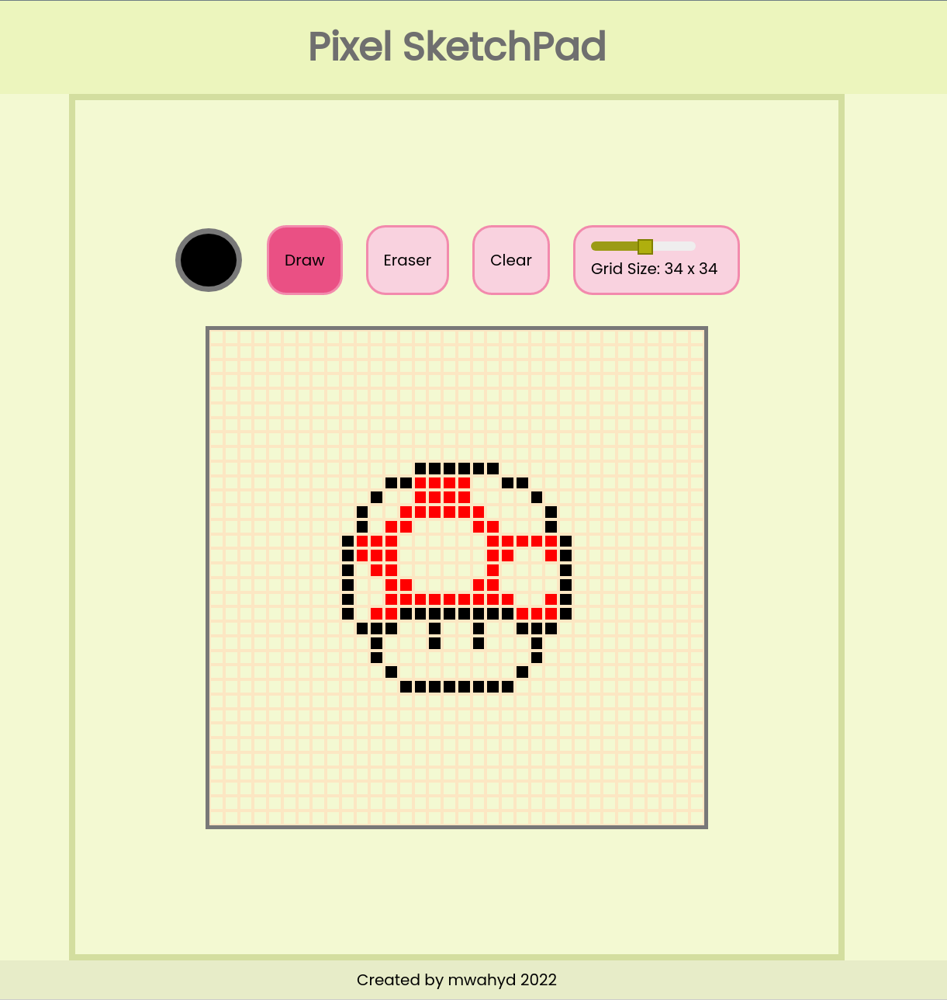

# Pixel Sketch App

[Live Web App](https://mwahyd.github.io/Etch-A-Sketch/)

A sketchpad app you can draw on.

App Functionalities:

- Click on draw button and paint using 2 colours (default colour black)
- Empty grid boxes will be highlighted in light blue
- Click and hold allows for multiple grid boxes to be coloured
- When eraser button is selected, upon mouse hover, over a box, it will be highligted to indicate coloured box
- Click and hold to erase multiple grid boxes
- Clear button will clear canvas.
- A clear canvas function
- Use the slider to create different grid sizes (up to 64 x 64 )

Features to Add:

- Colour palette not limited to just 2 colours 
- Change background styles of canvas

Tools:

- HTML
- CSS
- Javascript

d

